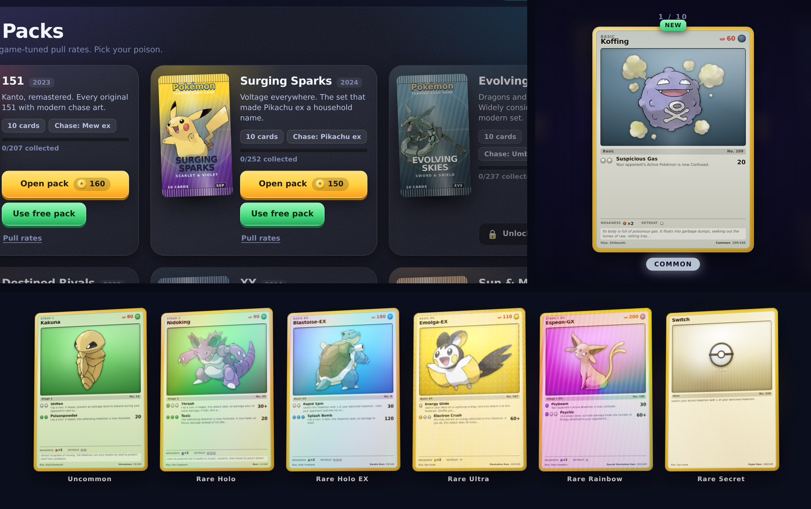

# Pack Rip — a Pokémon TCG booster opener

A browser game about the best part of the Pokémon TCG: tearing open a booster
pack. 2,134 real cards across 11 real sets, wrappers you rip with your own
cursor, and a foley-synth tear that sounds like actual foil.

Open `index.html`. No build step, no server, no dependencies.



## What's in it

**Real card data.** Every card is a genuine printed card — name, HP, types,
attacks and their damage and effect text, abilities, Trainer rules, weakness,
retreat, illustrator, set number and rarity. Sourced from
[PokemonTCG/pokemon-tcg-data](https://github.com/PokemonTCG/pokemon-tcg-data).

| Set | Year | Cards | Chase |
|---|---|---|---|
| Base Set | 1999 | 102 | Charizard |
| XY | 2014 | 146 | Xerneas EX |
| Sun & Moon | 2017 | 173 | Solgaleo GX |
| Evolving Skies | 2021 | 237 | Umbreon VMAX |
| Crown Zenith | 2023 | 160 | Giratina VSTAR |
| 151 | 2023 | 207 | Mew ex |
| Paldean Fates | 2024 | 245 | Shiny Charizard ex |
| Surging Sparks | 2024 | 252 | Pikachu ex |
| Prismatic Evolutions | 2025 | 180 | Umbreon ex |
| Destined Rivals | 2025 | 244 | Team Rocket's Mewtwo ex |
| Mega Evolution | 2025 | 188 | Mega Lucario ex |

**Packs you actually rip.** Each wrapper is drawn from its set's palette and
mascot — foil striping, crimped seals, Poké Ball watermark, set wordmark. Drag
across the top and it tears along a jagged seam: drag distance drives the tear,
drag *speed* drives the sound. Let go early and it stops mid-tear.

**Sound that isn't bleeps.** Nothing is sampled; it is all synthesised at
runtime in `js/audio.js`. The rip is granular foley — a few hundred noise grains
per second, each one a filtered micro-impulse with a 3–14 ms decay, which is
physically what tearing plastic film is. Three crackle textures are rendered
offline at startup and then played back with grain density and filter cutoff
mapped to your drag velocity, over a live friction bed. Rarity cues are additive
bells with inharmonic partials through a generated convolution reverb, escalating
to detuned saw swells and sub-bass on the big pulls.

**Foils.** Five shaders driven by pointer position and per-card seed: classic
holo spectrum bands, reverse-holo sparkle, Illustration Rare glitter, Special
Illustration Rare prism, and Hyper Rare brushed gold. Each is masked toward the
art window so the rules text stays readable, the way a real card works.

**The loop.** Coins, XP and levels; sets unlock as you level. Daily streak, a
free pack every 10 minutes, three rotating daily quests, 12 achievements, dupe
selling, a 9-pocket binder with per-set completion, and pity timers so a dry run
always ends.

## Pull rates

Rates are tuned for a game, not copied from the print run — hits land several
times more often here than in a real booster box. Per pack, in a modern set:

| | rate |
|---|---|
| Double Rare | ~1 in 2 packs |
| Illustration Rare | ~1 in 4.6 packs |
| Special Illustration Rare | ~1 in 13 packs |
| Hyper Rare | ~1 in 27 packs |
| God Pack (every slot a hit) | 1 in 256 |

Guaranteed floors, verified by simulating 20,000 packs: an Illustration Rare or
better within 14 packs, a Special Illustration Rare or better within 42.
Every set's exact numbers are in the **Pull rates** link on its shop card.

## Card art

Card faces render twice over. A complete TCG card face is drawn immediately from
the card's own data, using official Pokémon artwork bundled in `art/` (716 WebP
renders, ~11 MB, from [PokeAPI/sprites](https://github.com/PokeAPI/sprites)). If
a public card-image CDN is reachable, the real printed scan fades in on top.

This means the game never waits on the network and never shows a blank card —
with no connection at all it still looks complete. It was developed and
screenshotted with the card CDNs blocked, so the offline path is the tested one.

## Layout

```
index.html
css/   base · packs · cards · ui
js/    data (generated) · sets · core · state · audio · fx
       cardview · packview · packs · opener · binder · ui · main
art/   716 official artwork renders
tools/ build_data.py · build_art.py   (regenerate js/data.js and art/)
```

Plain scripts and relative paths, so `file://` works — `fetch` is never used and
the card database ships as a JS assignment rather than JSON.

Progress saves to `localStorage` under `pkmn-pack-opener-save-v1`. Reset it from
**Stats → Reset save**.

## Regenerating data

```sh
cd tools
python3 build_data.py          # expects raw/<set>.json from pokemon-tcg-data
python3 build_art.py dex.txt   # needs Pillow
```

## Credits and legal

Pokémon and the Pokémon TCG are trademarks of Nintendo / Creatures Inc. /
GAME FREAK inc. This is an unofficial fan project, not affiliated with or
endorsed by them, and nothing here is for sale — the coins are pretend and the
"market value" is a made-up number for the collection ticker. Card data from the
[Pokémon TCG API data set](https://github.com/PokemonTCG/pokemon-tcg-data);
artwork via [PokeAPI/sprites](https://github.com/PokeAPI/sprites).
